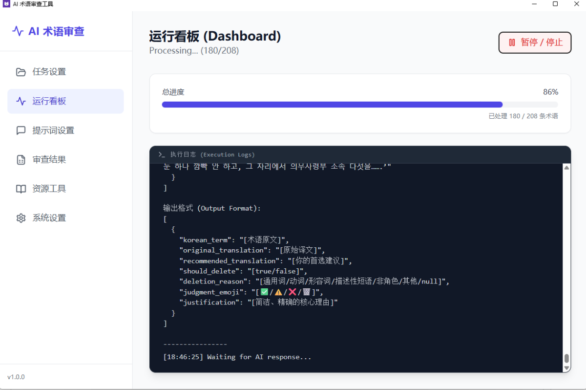
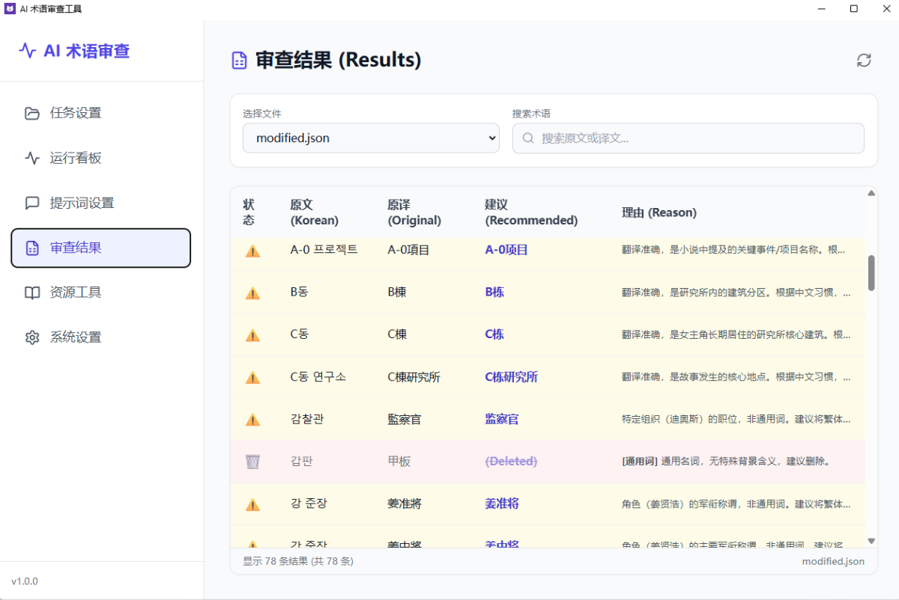
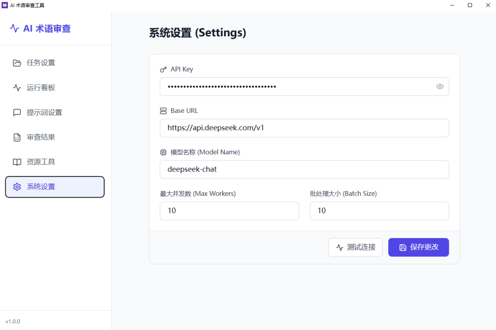

# Korean Glossary AI Review Tool / 韩中术语 AI 审查工具

[English](#english) | [中文](#chinese)

---

<a name="chinese"></a>
## 🇨🇳 中文说明

**韩中术语 AI 审查工具** 是一款专为小说翻译设计的桌面应用程序。它利用先进的 AI 模型（如 Deepseek）来批量审查韩中术语表，自动识别并标记通用词、多义词或翻译错误的术语，帮助译者和编辑快速清洗和优化术语库。

### ✨ 主要功能

*   **AI 智能审查**: 自动分析术语的准确性、一致性和必要性。
*   **批量处理**: 支持并行处理大量术语，高效快速。
*   **可视化看板**: 实时监控审查进度和 AI 执行日志。
*   **Excel 自动过滤**: 生成的最终术语表自带筛选功能，方便后续整理。
*   **修改日志**: 详细记录 AI 的每一次修改和删除操作及其理由。
*   **跨平台支持**: 提供 Windows 可执行文件，同时也支持通过源码在 Mac/Linux 上运行。

### 📸 界面预览

#### 1. 运行看板 (Dashboard)
实时查看任务进度和后台日志。


#### 2. 任务设置 (Task Setup)
配置待审查的文件夹和小说背景信息。


#### 3. 审查结果 (Results)
查看 AI 的修改建议和详细理由。


#### 4. 系统设置 (Settings)
配置 API Key、模型参数和并发数。


---

### 🚀 使用指南 (Windows 用户)

如果您使用的是 Windows 系统，可以直接运行打包好的程序，无需安装 Python 环境。

1.  **下载**: 前往 [Release 页面](https://github.com/oodadoudou/Korean_glossary_AI_review_UI/releases) 下载最新的安装包 (zip文件)。
2.  **运行**: 双击 `KoreanGlossaryReview.exe` 启动程序。
3.  **配置 API**:
    *   首次运行时，进入 **设置 (Settings)** 页面。
    *   输入您的 Deepseek API Key (或其他兼容 OpenAI 格式的 API Key)。
    *   点击保存。
4.  **开始任务**:
    *   进入 **任务 (Task)** 页面。
    *   选择包含 `.xlsx` 术语表和 `.txt` 参考文本的文件夹。
    *   输入小说背景设定（有助于 AI 更准确地判断）。
    *   点击 **开始审查**。
5.  **查看结果**:
    *   审查完成后，结果文件 `glossary_output.xlsx` (最终术语表) 和 `modified.xlsx` (修改日志) 会生成在您选择的文件夹中。
    *   您也可以在 **结果 (Results)** 页面直接查看修改详情。

---

### 💻 开发者指南 / 源码运行 (Mac/Linux/Windows)

如果您是开发者，或者需要在非 Windows 平台上运行，可以通过源码启动。

#### 环境要求
*   Python 3.8+
*   Node.js (仅用于前端开发，运行只需 Python)

#### 安装步骤

1.  **克隆项目**:
    ```bash
    git clone https://github.com/your-repo/korean-glossary-review.git
    cd korean-glossary-review
    ```

2.  **安装 Python 依赖**:
    ```bash
    pip install -r requirements.txt
    ```
    *注意: 如果 `requirements.txt` 不存在，请手动安装以下核心库:*
    ```bash
    pip install flask pandas openai pywebview xlsxwriter openpyxl
    ```

3.  **运行程序**:
    ```bash
    python run.py
    ```
    或者
    ```bash
    python backend/app.py
    ```

#### 前端开发 (可选)
前端代码位于 `frontend/` 目录，基于 React + Vite。
```bash
cd frontend
npm install
npm run dev
```

---

<a name="english"></a>
## 🇺🇸 English Description

**Korean Glossary AI Review Tool** is a desktop application designed for novel translation. It leverages advanced AI models (like Deepseek) to batch review Korean-Chinese glossaries, automatically identifying and flagging generic terms, polysemes, or translation errors, helping translators and editors quickly clean and optimize their term bases.

### ✨ Key Features

*   **AI-Powered Review**: Automatically analyzes term accuracy, consistency, and necessity.
*   **Batch Processing**: Supports parallel processing for high efficiency.
*   **Visual Dashboard**: Real-time monitoring of review progress and execution logs.
*   **Excel AutoFilter**: Generated glossaries come with auto-filters for easy sorting.
*   **Modification Log**: Detailed records of every AI modification/deletion with justifications.
*   **Cross-Platform**: Available as a Windows executable, and runs from source on Mac/Linux.

### 🚀 Usage Guide (Windows)

1.  **Download**: Go to the [Release Page](https://github.com/oodadoudou/Korean_glossary_AI_review_UI/releases) and download the latest package (zip file).
2.  **Run**: Double-click to start.
3.  **Configure**: Go to **Settings**, enter your API Key, and save.
4.  **Start**: Go to **Task**, select your working directory (containing `.xlsx` glossary and `.txt` reference), input the novel background, and click **Start**.
5.  **Result**: Check `glossary_output.xlsx` in your folder or view details in the **Results** tab.

### 💻 Run from Source (Mac/Linux)

1.  **Install Python 3.8+**.
2.  **Install Dependencies**:
    ```bash
    pip install flask pandas openai pywebview xlsxwriter openpyxl
    ```
3.  **Run**:
    ```bash
    python run.py
    ```

---

### 🔒 Security Note / 安全提示

*   **API Key**: Your API Key is stored locally in `cfg.json`. This file is **gitignored** and will not be uploaded to version control.
*   **Privacy**: The application only sends glossary terms to the AI provider (e.g., Deepseek) for processing. No other data is collected.
*   **API Key**: 您的 API Key 存储在本地的 `cfg.json` 文件中。该文件已被加入 `.gitignore`，不会被上传到版本控制系统。

---

### 📁 Project Structure / 项目结构

*   `backend/`: Flask server and core logic (AI service, engine).
*   `frontend/`: React + Vite UI source code.
*   `dist/`: Compiled frontend assets and Windows executable.
*   `run.py`: Application entry point.
*   `build_exe.py`: PyInstaller build script.

---

**License**: MIT