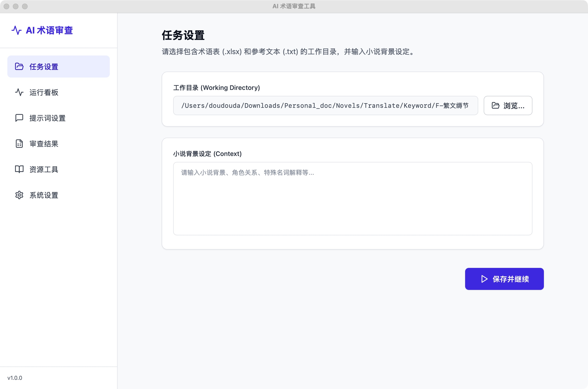
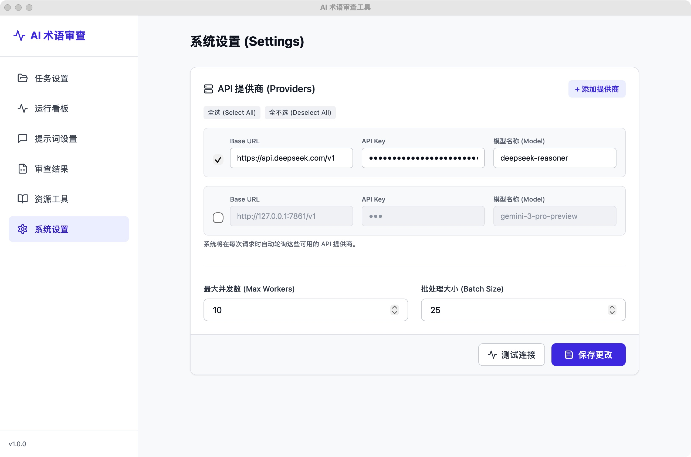

# Korean Glossary AI Review Tool / 韩中术语 AI 审查工具

[English](#english) | [中文](#chinese)

---

<a name="chinese"></a>
## 🇨🇳 中文说明

**韩中术语 AI 审查工具** 是一款专为小说翻译设计的桌面应用程序。利用 Deepseek 等 AI 模型批量审查韩中术语表，自动识别并标记通用词、多义词或翻译错误，辅助清洗和优化术语库。

### ✨ 主要功能 (v2.0)

*   **智能分级审查**:
    *   **Tier S (核心设定)**: 背景设定中的词汇将被严格保护。
    *   **Tier A (高频词)**: 出现 >5 次的词汇视为重要术语，重点排查错误提取的常用词。
    *   **Tier C (低频词)**: 出现 1-3 次的词汇将被严格审查，建议删除通用词。
*   **全上下文感知**: 综合**权重等级**、**背景设定**及**原文上下文**进行判断。
*   **Prompt Playground**: 批量审查前测试和微调提示词。
*   **API 管理**: 支持混合配置多个 API（Key/Base URL/模型），自动轮询。
*   **断点续传**: 任务中断后可从断点恢复。
*   **多轮审查**: 支持 1-10 轮审查，基于历史记忆持续优化。
*   **标准化文件**: 中间文件采用 `_n` 后缀管理。
*   **跨平台**: 支持 Windows (exe)、Docker 及源码运行。

### 📸 界面预览

#### 1. 运行看板 (Dashboard)
查看进度和日志。设置**审查轮次**。


#### 2. 任务设置 (Task Setup)
配置文件夹和小说背景。


#### 3. 审查结果 (Results)
查看修改建议。**“轮次”**列显示修改阶段。


#### 4. 系统设置 (Settings)
配置 API Key、模型和并发数。


#### 5. 提示词设置 (Prompts)
配置审查提示词。


---

### 🚀 使用指南 (Windows)

无需安装 Python 环境。

1.  **下载**: 从 [Release 页面](https://github.com/oodadoudou/Korean_glossary_AI_review_UI/releases) 下载最新安装包。
2.  **运行**: 双击 `KoreanGlossaryReview.exe`。
3.  **配置 Context**:
    *   进入 **设置 (Settings)**。
    *   输入 API Key。
    *   保存。
4.  **开始任务**:
    *   进入 **任务 (Task)**。
    *   选择包含 `.xlsx` 和 `.txt` 的文件夹。
    *   输入小说背景设定。
    *   进入 **运行看板 (Dashboard)**，设置 **审查轮次** (建议 1-3)。
    *   点击 **开始审查**。
5.  **查看结果**:
    *   完成后生成 `glossary_output_final.xlsx` 和 `modified.xlsx`。
    *   中间文件位于 `log/` 目录。
    *   可在 **结果 (Results)** 页面查看详情。

---

### 💻 开发者指南 / 源码运行 (Mac/Linux/Windows)

#### 环境要求
*   Python 3.11+
*   Node.js (仅前端开发)

#### 安装步骤

1.  **克隆项目**:
    ```bash
    git clone https://github.com/your-repo/korean-glossary-review.git
    cd korean-glossary-review
    ```

2.  **安装依赖**:
    ```bash
    pip install -r requirements.txt
    ```

3.  **运行**:
    ```bash
    python3 run.py
    ```

#### 前端开发 (可选)
```bash
cd frontend
npm install
npm run dev
```

### 🐳 Docker 部署

1.  **启动服务**:
    ```bash
    docker-compose up -d
    ```
2.  **访问应用**:
    浏览器访问 `http://localhost`。

---

<a name="english"></a>
## 🇺🇸 English Description

**Korean Glossary AI Review Tool** is a desktop application for novel translation. It leverages AI models (e.g., Deepseek) to batch review Korean-Chinese glossaries, identifying generic terms, polysemes, or errors to optimize term bases.

### ✨ Key Features (v2.0)

*   **Smart Tiered Review**:
    *   **Tier S (Core Lore)**: Strictly protected terms found in background settings.
    *   **Tier A (High Freq)**: Terms appearing >5 times; strictly checked for extraction errors.
    *   **Tier C (Low Freq)**: Terms appearing 1-3 times; generic words suggested for deletion.
*   **Context Awareness**: Decisions based on **Weight Tiers**, **Background**, and **Context**.
*   **Prompt Playground**: Test prompts before batch runs.
*   **Multi-Provider**: Manage multiple API providers (keys/URLs/models) with auto-rotation.
*   **Resume Capability**: Resume interrupted tasks from checkpoints.
*   **Multi-Round**: iteratively refine results (1-10 rounds) with **History Memory**.
*   **Standardized Files**: Managed via `_n` suffix.
*   **Cross-Platform**: Windows (.exe), Docker, or Source.

### 🚀 Usage Guide (Windows)

1.  **Download**: Get latest package from [Releases](https://github.com/oodadoudou/Korean_glossary_AI_review_UI/releases).
2.  **Run**: Open `KoreanGlossaryReview.exe`.
3.  **Configure**: In **Settings**, enter API Key and save.
4.  **Start**: 
    *   In **Task**, select directory (with `.xlsx` glossary & `.txt` reference) and input background.
    *   In **Dashboard**, set **Review Rounds** (1-3).
    *   Click **Start Review**.
5.  **Result**: 
    *   Files `glossary_output_final.xlsx` and `modified.xlsx` generated in folder.
    *   Intermediate files in `log/`.
    *   View details in **Results**.

### 💻 Run from Source (Mac/Linux)

1.  **Install Python 3.11+**.
2.  **Install Dependencies**:
    ```bash
    pip install -r requirements.txt
    ```
3.  **Run**:
    ```bash
    python3 run.py
    ```

### 🐳 Docker Deployment

1.  **Start Services**:
    ```bash
    docker-compose up -d
    ```
2.  **Access Application**:
    Navigate to `http://localhost`.

---

### 🔒 Security Note / 安全提示

*   **API Key**: Stored locally in `cfg.json`. Not uploaded to version control.
*   **Privacy**: Only glossary terms sent to AI provider. No other data collected.
*   **API Key**: 您的 API Key 存储在本地的 `cfg.json` 文件中。该文件已被加入 `.gitignore`，不会被上传到版本控制系统。

---

### 📁 Project Structure / 项目结构

*   `backend/`: Flask server and core logic (AI service, engine).
*   `frontend/`: React + Vite UI source code.
*   `dist/`: Compiled frontend assets and Windows executable.
*   `run.py`: Application entry point.
*   `build_exe.py`: PyInstaller build script.

---

**License**: MIT