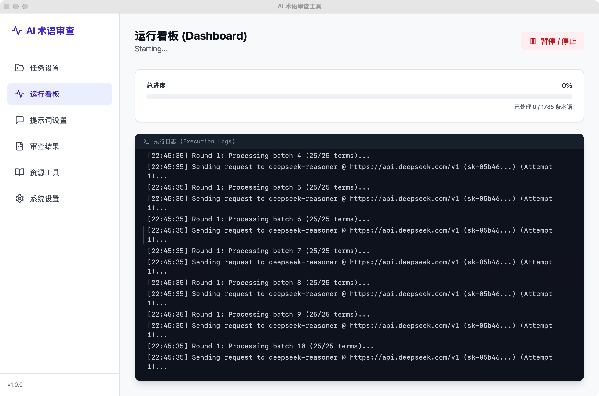
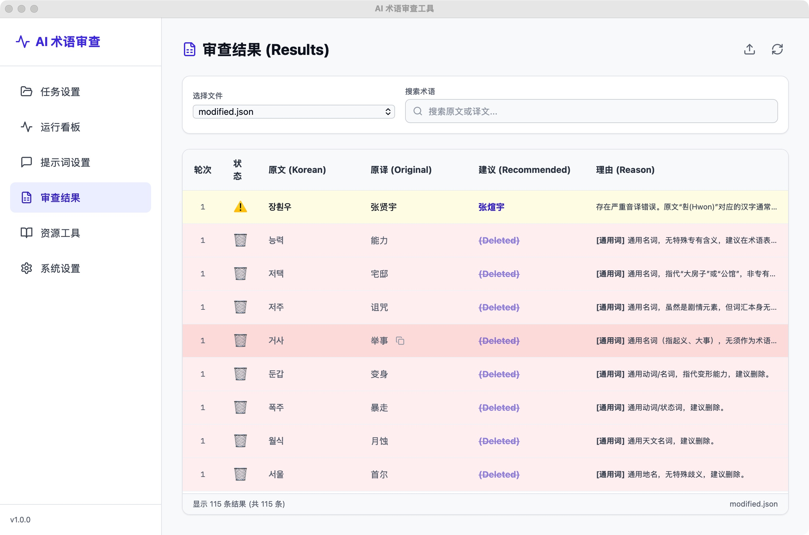
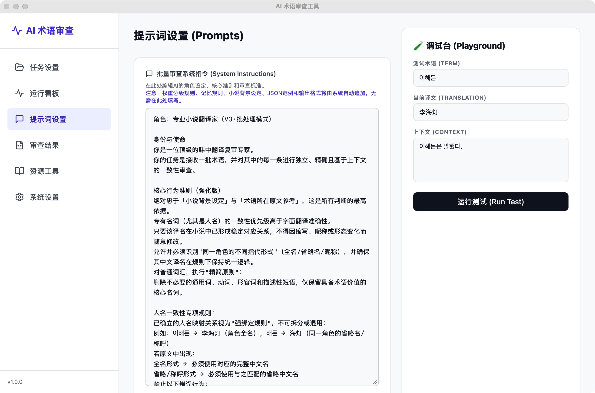

# Korean Glossary AI Review Tool / 韩中术语 AI 审查工具

[](https://github.com/oodadoudou/Korean_glossary_AI_review_UI/releases/latest)

[English](#english) | [中文](#chinese)

---

<a name="chinese"></a>
## 🇨🇳 中文说明

**韩中术语 AI 审查工具** 是一款专为小说翻译设计的桌面应用程序。利用 Deepseek 等 AI 模型批量审查韩中术语表，自动识别并标记通用词、多义词或翻译错误，并提供**词性/分类建议**，辅助清洗和优化术语库。

📩 **最新版本下载传送门**: 👉 [点击此处前往 Releases 页面下载最新 `.exe` 安装包](https://github.com/oodadoudou/Korean_glossary_AI_review_UI/releases/latest)

### ✨ 主要功能 (v2.2.0+)

*   **全自动热更新机制 (New)**: 界面左下角实时侦测 GitHub 最新的 Release。一键全自动下载、并执行安全的热替换更新协议并自动重启程序，最大程度保留您的本地配置文件。
*   **分类智能建议 (New)**: 审查结果面板现已全面支持基于 AI 推理的分类调整。界面会以**智能对比（删除线与高亮箭头指示）**可视化展示原始类别与 AI 建议类别的变更。
*   **智能分级审查**:
    *   **Tier S (核心设定)**: 背景设定中的词汇将被严格保护。
    *   **Tier A (高频词)**: 出现 >5 次的词汇视为重要术语，重点排查错误提取的常用词。
    *   **Tier C (低频词)**: 出现 1-3 次的词汇将被严格审查，建议删除通用词。
*   **API 管理**: 支持混合配置多个 API（Key/Base URL/模型），自动轮询。
*   **断点续传 & 标准化输出**: 任务中断后可无缝从进度断点恢复。
*   **多轮审查**: 支持 1-10 轮审查，基于历史记忆持续优化。

### 📸 界面预览

#### 1. 运行看板 (Dashboard) & 热更新
查看进度和日志。设置**审查轮次**。左下角具备更新追踪器。


#### 2. 分类建议审查结果 (Results)
查看修改建议。新增**"分类建议 (Category)"**智能对比列，直接显示改动。


#### 3. 提示词设置 (Prompts)
配置审查提示词。


---

### 💻 开发者与源码运行指南 (Mac/Linux/Windows)

#### 环境要求
*   Python **3.12+** (推荐 3.12.x 系列以保证与 `pythonnet` 及 `webview` 最佳兼容性)
*   Node.js **18+** / npm **9+** (前端开发)

#### 安装步骤

1.  **克隆项目**:
    ```bash
    git clone https://github.com/oodadoudou/Korean_glossary_AI_review_UI.git
    cd Korean_glossary_AI_review_UI
    ```

2.  **安装 Python 后端依赖**:
    ```bash
    pip install -r requirements.txt
    ```

3.  **运行项目 (推荐使用安全入口)**:
    ```bash
    python run_safe.py
    ```

#### 前端开发 (Vite + React)
```bash
cd frontend
npm install
npm run dev
```

### 🐳 Docker 部署
```bash
docker-compose up -d
```
浏览器访问 `http://localhost` 即可体验。

---

<a name="english"></a>
## 🇺🇸 English Description

**Korean Glossary AI Review Tool** is a desktop application tailored for novel translation. It leverages AI models (e.g., Deepseek) to batch review Korean-Chinese glossaries, identifying generic terms, polysemes, or translation errors, and automatically suggesting **term categories/POS adjustments** to optimize term bases.

📩 **Download the Latest Release Here**: 👉 [Click to visit the Releases Page for the latest `.exe`](https://github.com/oodadoudou/Korean_glossary_AI_review_UI/releases/latest)

### ✨ Key Features (v2.2.0+)

*   **Automated Seamless Hot-Updates (New)**: The UI actively audits GitHub Releases natively in the background. A user-friendly 1-click update process safely downloads, orchestrates Windows batch file replacements, and restarts the engine without dropping local API config files.
*   **Crash Interceptor & Safe Boot (New)**: Escaped the notorious PyWebView silent-crash loops. The application is newly containerized under `run_safe.py`, which forcibly traps missing system dependencies (such as C++ `WebView2Loader` bindings) into native visual Error Dialogs and dumps the stack to `fatal_crash_log.txt`.
*   **AI Category Suggestions (New)**: 
    * The Review Results data-grid now tracks original vs AI-suggested categories natively. 
    * Renders dynamic UI cells utilizing strikethrough styling and amber directional arrows for transparent category auditing.
*   **Smart Tiered Review**:
    *   **Tier S (Core Lore)**: Strictly protected terms found in background settings.
    *   **Tier A (High Freq)**: Terms appearing >5 times; strictly checked for extraction errors.
    *   **Tier C (Low Freq)**: Terms appearing 1-3 times; generic words suggested for deletion.
*   **Multi-Provider**: Manage multiple LLM providers (keys/URLs/models) with autonomous round-robin rotation.
*   **Resume Capability**: Checkpoint-based execution preventing loss of LLM credits on abrupt stops.
*   **Multi-Round**: Iteratively refine judgments (1-10 rounds) utilizing memory arrays.

### 🚀 Usage Guide (Windows Pre-compiled)

1.  **Download**: Get the latest `.zip` package from the [Releases](https://github.com/oodadoudou/Korean_glossary_AI_review_UI/releases).
2.  **Extract & Run**: Unzip into a folder and double-click `KoreanGlossaryReview.exe`. *(Note: For versions >= 2.2.0, you can use the in-app update button moving forward.)*
3.  **Configure API**: Go to the **Settings** tab and populate your provider API Key.
4.  **Execute**: Head to **Task**, select the workspace directory containing your `.xlsx` target and `.txt` reference files -> Launch via **Dashboard**.

### 💻 Run from Source (Mac/Linux)

1.  **Install Python 3.12+**.
2.  **Install Dependencies**:
    ```bash
    pip install -r requirements.txt
    ```
3.  **Launch via Safe Boot**:
    ```bash
    python run_safe.py
    ```

### 🔒 Security & Privacy Note / 安全隐私声明

*   **API Key Storage**: Your sensitive tokens are locally encrypted/written to `cfg.json` which is ignored by git version control. 
*   **Data Minimization**: Only the granular glossary terms and user-provided background strings are proxied to the LLM. No background file scanning exists.

---

### 📁 Architecture & Compilation / 项目架构体系

*   `backend/`: Flask server, AI context manager, and `updater.py` (Local patching logic).
*   `frontend/`: React + Vite UI architecture (`ReviewResults.jsx` holds the category renders).
*   `run_safe.py` / `run.py`: The application entry points (Anti-crash logic vs raw standard out).
*   `build_exe.py`: The massively refactored PyInstaller build script strictly enforcing OS architecture DLL injections (`WebView2`, `Python.Runtime`).

---
**License**: MIT
